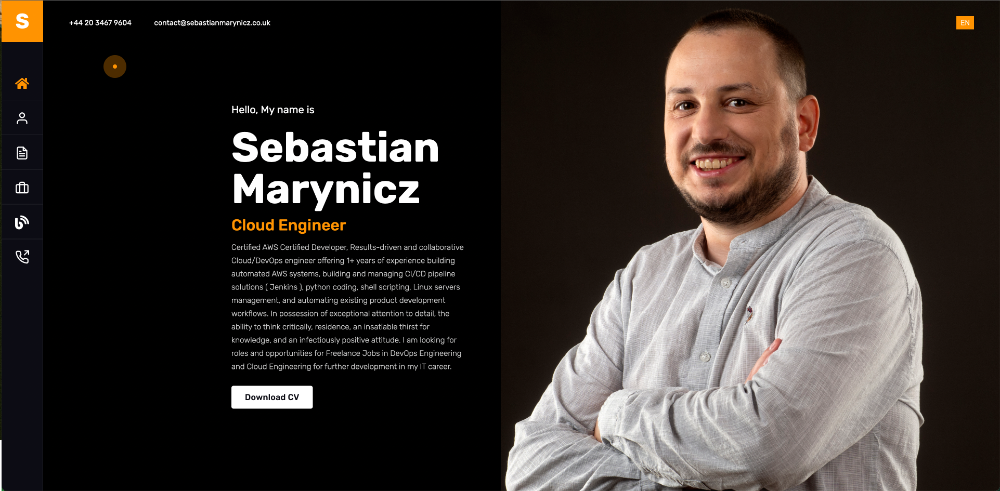
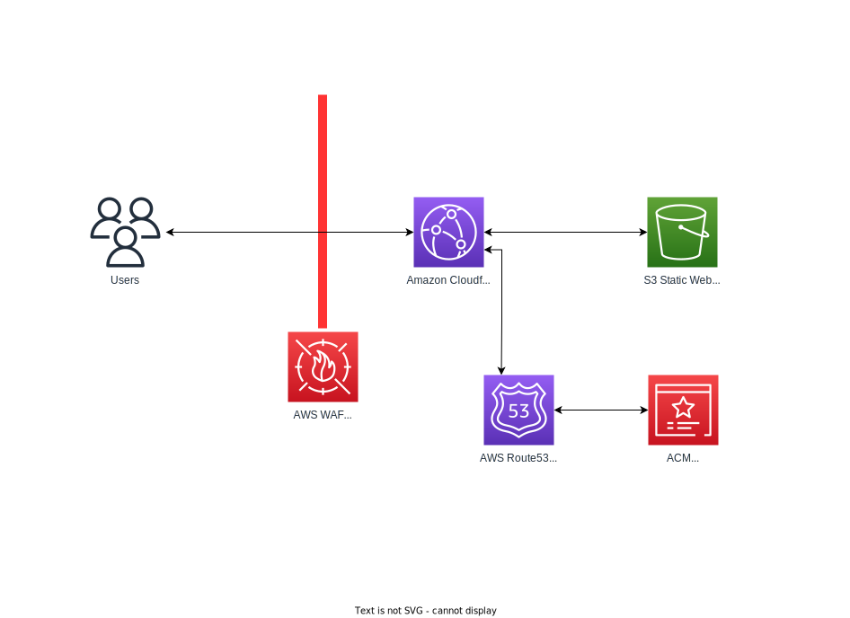

# Resume Project 
 

This is a personal portfolio website for Sebastian Marynicz. It is built using [themeforest](https://themeforest.net/) and the [themeforest](https://themeforest.net/item/nairo-react-personal-portfolio-template/33404455) theme.

The project is Deployed to AWS with Configured CDN (Content Delivery Network) with TLS on AWS CloudFront. 

## Preview
 

[Live Preview](https://www.sebastianmarynicz.co.uk/)

# Application architecture
 

 
 

This project is basically a static website hosted on S3, Configured CDN (Content Delivery Network) with TLS on AWS CloudFront.
 

For email delivery, I use AWS SES (Simple Email Service) and for DNS I use AWS Route53.
 

For Phone number I use Amazon Connect to route calls to my mobile phone.
 

For web application firewall i use AWS WAF, which is a web application firewall that helps protect your web applications or APIs against common web exploits and bots that may affect availability, compromise security, or consume excessive resources.

## Infrastructure as Code with Terraform
 

This is a project making use of AWS and Terraform to host my Resume at [Terraform IaC](https://github.com/TrinityWeaver/tf-resume-project)

## Build pipeline
 

This project is built using [GitHub Actions](https://github.com/TrinityWeaver/resume-project/actions), which use CodeQL ( Security Code Scanning ), builds and deploys the latest React Project.
